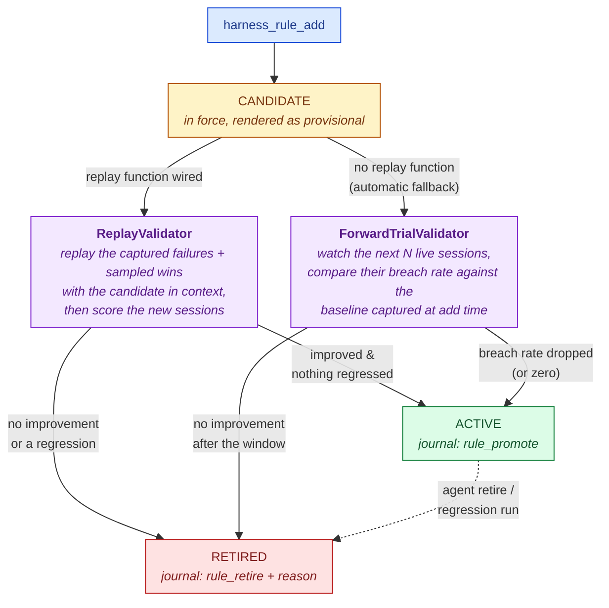

A self-authored rule is a hypothesis, not a fact. Since v0.6, `harness_rule_add` records a **candidate**, and the harness gathers evidence — automatically, with no human involved — before trusting it:



Candidates are injected into the system context (under the *"Provisional rules (under evaluation)"* heading) — a rule must be in force to be measurable — but the agent and every reader can see they are unproven.

## Replay validation — the strong path

The PandaProbe platform is passive and trace-based: it scores traces a session already produced, so nobody can re-score the past "as if the rule had existed". Counterfactual evidence requires re-running the scenario — and only you can re-run your agent. That is the [replay function](/harness/closed-loop/eval-set-and-replay#the-replay-function):

```python
harness = Harness.create(replay=my_replay_fn)
```

When a candidate lands and a matching, replayable [eval case](/harness/closed-loop/eval-set-and-replay) exists, the `ReplayValidator`:

1. Selects the newest failing cases whose signatures match the candidate (up to 3), plus up to 2 protected `win` cases to catch collateral damage.
2. Renders the **current** rules — candidate included — and calls your replay function per case, sequentially and time-bounded (`replay_timeout_s`).
3. Scores each returned session directly through the evaluator (never through the live turn pipeline).
4. **Promotes** iff the targeted metric improved past `rule_promote_margin` on a failing case **and** no case — failure or win — regressed past `rule_regress_margin` on any metric. Otherwise **retires**, with the exact reason journaled.

Inconclusive rounds (a replay that raised, timed out, or produced no comparable scores) are evidence of nothing: the candidate stays pending, and after three inconclusive replay rounds validation relies on the forward trial instead.

## Forward trials — the automatic fallback

Without a replay function, nothing breaks and nothing is silently faked: the fallback is announced once (log + a `validation` journal event) and validation turns statistical.

- **Baseline, captured at add time:** the fraction of recently-journaled sessions whose notices matched the rule's metric family (`breach:` / `relative:` / `trend:` / `percentile:` on the rule's metric). With no history the baseline is `1.0` — the rule was authored against a live failure, so assume it was firing.
- **Trial:** every handled report — healthy or alerting — enrolls its session (up to `rule_trial_min_sessions`, default 5, distinct sessions) and records whether that session showed the target condition while the candidate was in force.
- **Verdict:** promote when the trial breach rate is `0`, or improved on the baseline by at least `rule_promote_margin`; otherwise retire.

<Note>
  The baseline denominator only sees sessions that journaled an incident, which biases it *high* — making the forward trial lenient about promotion, never about retirement. Replay remains the strong evidence path; wire one if you can.
</Note>

## How validation runs

You never call the validators yourself in normal operation. The hook feeds every handled report into the validation engine and kicks a **single-flight** background round — validation never blocks a turn, never touches the live evaluation bookkeeping, and any failure inside it degrades to a log line.

For tests, scripts, and deterministic pipelines:

```python
verdicts = await harness.validate_candidates()   # run one round now
await harness.drain_validation()                 # join any in-flight round (bounded)
```

## Observing the lifecycle

Every transition is journaled with its evidence, and the agent can ask directly:

```python
status = await harness.toolset.call("harness_rule_status", {"rule_id": "r-23b0460306"})
# {
#   "ok": true,
#   "rule": {..., "status": "active"},
#   "lifecycle": {
#     "status": "active",
#     "baseline_rate": 1.0, "trial_rate": 0.0,
#     "sessions_observed": 5, "sessions_needed": 5,
#     "replay_attempts": 0,
#     "verdict": "promoted:replay: agent_reliability improved past margin..."
#   }
# }
```

`harness_reflect` additionally returns recent `rule_promote` / `rule_retire` events, so the agent's reflection cycle learns which *kinds* of rules survive validation.

## Configuration

| Knob | Default | Meaning |
| --- | --- | --- |
| `rule_validation` | `true` | The candidate lifecycle. `false` restores add→active (pre-v0.6 behavior). |
| `rule_trial_min_sessions` | `5` | Distinct live sessions a forward trial observes before a verdict. |
| `rule_promote_margin` | `0.05` | Minimum improvement of the targeted metric to promote. |
| `rule_regress_margin` | `0.05` | Maximum tolerated drop on any other case/metric. |
| `replay_timeout_s` | `300` | Hard bound per replay invocation — a hung replay degrades to inconclusive, never wedges validation. |
