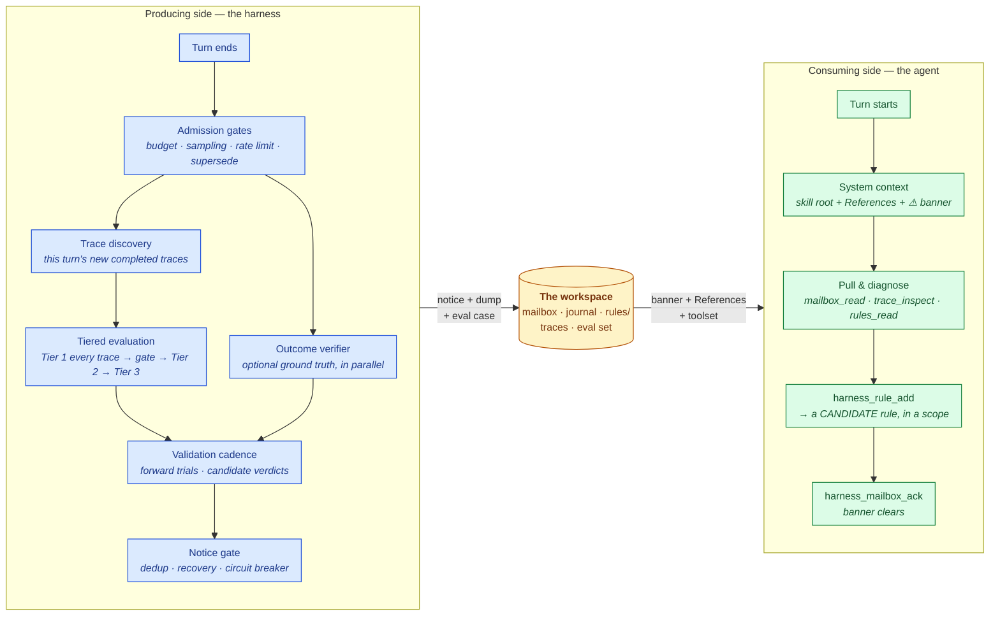

The harness has two sides. The **producing side** runs after every turn and writes to the workspace; the **consuming side** is your agent, reading the workspace through its system context and toolset. The workspace on disk is the only thing connecting them — nothing is ever pushed into the agent's conversation.



The loop closes back through the workspace: the candidate rule the agent records lands in the rule store, the producing side's validation cadence proves (or retires) it, and the **per-turn barrier** makes sure all of that has landed before the agent's next turn begins.

## The producing side, step by step

1. **Turn end.** Your loop (or a framework adapter) calls `on_turn_end` with the session id and turn payload. This returns immediately — nothing on this path blocks your agent.
2. **Admission gates.** Cheap producer-side controls run first: a hard per-process eval budget, per-session turn sampling, and a per-session rate limit. A newer turn *supersedes* the session's in-flight evaluation.
3. **Trace discovery.** A background task lists the session's completed traces (newest-first from the platform, replayed oldest-first) and keeps a per-session seen-set, so each turn scores only what is new.
4. **Tiered evaluation.** Tier 1 scores every new trace in one batched run and folds each into the trajectory gate; a gate breach escalates to Tier 2 on the last trace only; a confirmed Tier-2 breach may pull in Tier 3. See [Evaluation & detection](/harness/loop/evaluation).
5. **Outcome verification.** If you wired a [verifier](/harness/closed-loop/outcome-verifier), it runs *alongside* the tier ladder (it depends only on the turn payload, so stacking its latency after the ladder would be wasteful) and contributes a synthetic `outcome_correct` score.
6. **Validation cadence.** Every handled report — healthy or not — feeds the candidate-rule validation engine: forward trials get their denominator, and a single-flight task evaluates open candidates. See [Rule validation](/harness/closed-loop/rule-validation).
7. **Notice gate.** Identical conditions are de-duplicated per session, recoveries are journaled, and a circuit breaker escalates notice storms to a single `needs_human`.
8. **Persistence.** A surviving condition becomes a `DiagnosticNotice` in `mailbox/pending/`, a verbose dump under `traces/`, and a journal event — and, when the severity is `breach` and capture is enabled, a replayable **eval case**.

## The consuming side

`harness.system_context()` returns one block to prepend to your system prompt:

1. **The skill root** — the self-healing contract (what the tiers measure and what the gate flags), the tool table, guidance on where to file a rule, and the rule lifecycle.
2. **The References index** — which rule files exist and how many rules each holds. **No rule bodies.** The agent reads the files it wants with `harness_rules_read`.
3. **The banner** — a count and max severity when notices are pending; nothing otherwise.

The agent acts through the [toolset](/harness/loop/agent-toolset): 10 operations delivered natively (Anthropic / LangChain / OpenAI tool formats) or through the sandbox-friendly `pandaprobe-harness-agent` companion CLI.

## The workspace on disk

Everything the harness knows lives under one directory — inspectable, greppable, and durable across process restarts:

```text
/harness/                            (HARNESS_ROOT)
├── mailbox/
│   ├── pending/<notice-id>.json     # posted by the hook, pulled by the agent
│   ├── processed/<notice-id>.json   # acknowledged notices, with resolution
│   └── status.json                  # cheap summary read by the banner
├── journal.jsonl                    # append-only cross-run event log
├── rules.jsonl                      # structured rules (latest record per id wins)
├── harness_rules.md                 # the SKILL ROOT: protocol + References index
├── rules/                           # the agent's own rule files — pulled, never pushed
│   ├── global.md                    #   always-in-force rules
│   ├── scoped.md                    #   step-level rules (the default)
│   └── <topic>.md                   #   any topic file the agent creates
├── evalset/<case-id>.json           # replayable eval cases (failures + protected wins)
├── traces/
│   ├── latest_eval.json             # most recent eval dump (always written)
│   └── <notice-id>.json             # one immutable dump per notice
└── state/score_history.json         # per-(session, metric) series + trajectory-gate state
```

All writes are atomic (unique temp file + rename) and the stores are lock-guarded, so one workspace can safely serve many concurrent sessions. Provisioning is idempotent: an existing skill root is never overwritten, and the `rules/` subtree is regenerated from `rules.jsonl` on every change.

## Journal event types

The journal is the harness's cross-run memory. Every notable event is one JSON line:

| Type | Written when |
| --- | --- |
| `notice` | A diagnostic notice is posted (or would be, in `observe_only` mode). |
| `ack` | The agent acknowledges a notice, optionally linking the resolving rule. |
| `rule_add` | A rule is recorded (as a candidate by default). |
| `rule_promote` | A validator promoted a candidate to active — with the reason and which validator. |
| `rule_retire` | A rule was retired (by a validator, the agent, or a regression run) — with the reason. |
| `validation` | Announced once when no replay function is wired and validation falls back to forward trials. |
| `evalset_capture` | A `breach`-severity session was captured as an eval case. |
| `regression` | A regression run completed, with per-case results. |
| `recovery` | A previously-alerting session scored clean again. |
| `health` | The startup health check ran (ok or degraded, with the reason). |
| `skip` | An evaluation was skipped (e.g. the eval budget is exhausted). |

```python
harness.journal.recent(20, types=("notice", "rule_promote"))
```

## One healing cycle, end to end

```text
health → notice(trend) → notice(breach) → evalset_capture → rule_add → ack
       → recovery → rule_promote → regression
```

1. Turns 1–5 make no progress on the task: `task_completion` sits flat and the trajectory gate closes its window → **`stall:task_completion`**. Tier 2 comes back clean, so this is an advisory **`trend`** notice — the agent is told, but nothing is captured to train on.
2. Turn 6 repeats an identical payment call. The gate fires again, Tier 2 escalates, and `tool_correctness` scores `0.20` → a **`breach`** notice with `trace_id`, `tier: 2`, and `scope_hint: "scoped"`. The session is captured as a replayable **failure case**.
3. The barrier holds the loop until that has landed, so turn 7 opens with the notice already in the mailbox. The agent reads it, inspects the flagged trace, reads `rules/scoped.md`, and records *"Never call the payment tool twice without verifying the transaction status"* → a **candidate** rule in the `scoped` file.
4. The harness replays the captured failure with the candidate in force; the replayed session's trace metrics improve → the candidate is **promoted** (`rule_promote`, validator `replay`).
5. Subsequent turns climb instead of stalling (**recovery**), and a regression run replays the corpus against the current rules: the old failure is `improved`, the protected win `unchanged` — **CLEAN**.

The repository's `examples/closed_loop_self_heal.py` prints a version of this you can run offline, with no credentials.
