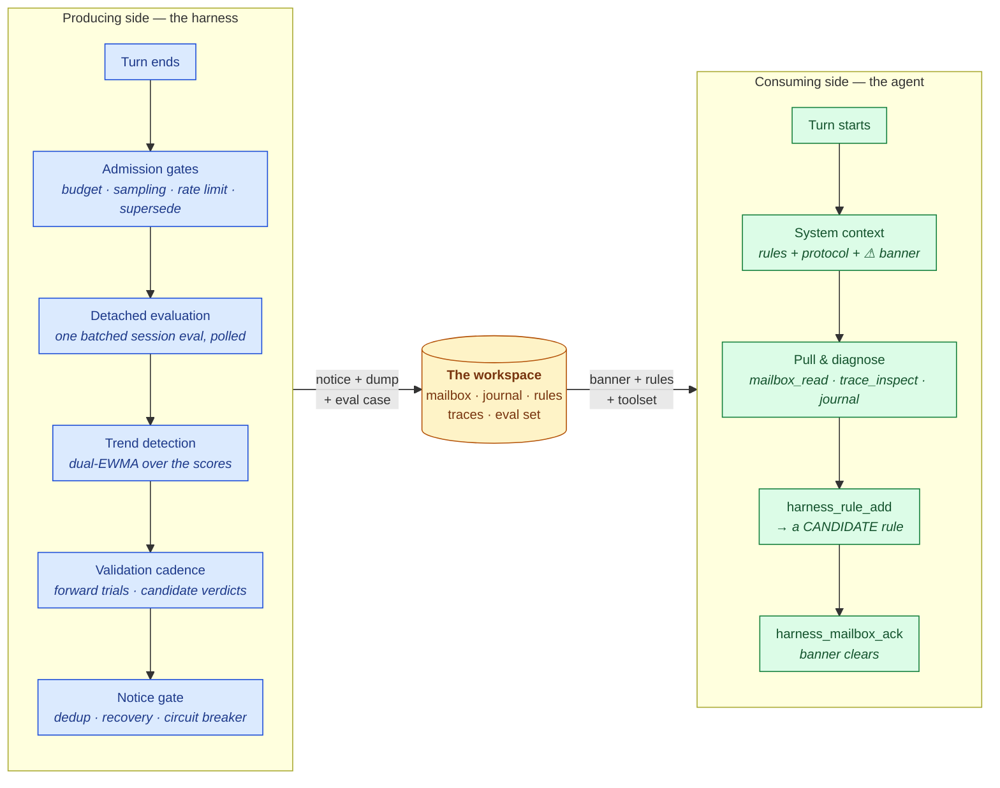

The harness has two sides. The **producing side** runs after every turn and writes to the workspace; the **consuming side** is your agent, reading the workspace through its system context and toolset. The workspace on disk is the only thing connecting them — nothing is ever pushed into the agent's conversation.



The loop closes back through the workspace: the candidate rule the agent records lands in the rule store, the producing side's validation cadence proves (or retires) it, and the validated rule re-enters the system context on the next turn.

## The producing side, step by step

1. **Turn end.** Your loop (or a framework adapter) calls `on_turn_end` with the session id and turn payload. This returns immediately — nothing on this path blocks your agent.
2. **Admission gates.** Cheap producer-side controls run first: a hard per-process eval budget, per-session turn sampling, and a per-session rate limit. A newer turn *supersedes* the session's in-flight evaluation.
3. **Detached evaluation.** A background task checks platform health (once, memoized), then runs one batched session evaluation under a global concurrency cap and polls it to completion. See [Evaluation & detection](/harness/loop/evaluation).
4. **Trend detection.** Every resolved score feeds a local dual-EWMA detector, so a slow decline is caught even when no absolute threshold is crossed.
5. **Validation cadence.** Every handled report — healthy or not — feeds the candidate-rule validation engine: forward trials get their denominator, and a single-flight task evaluates open candidates. See [Rule validation](/harness/closed-loop/rule-validation).
6. **Notice gate.** Identical conditions are de-duplicated per session, recoveries are journaled, and a circuit breaker escalates notice storms to a single `needs_human`.
7. **Persistence.** A surviving condition becomes a `DiagnosticNotice` in `mailbox/pending/`, a verbose dump under `traces/`, a journal event — and, when capture is enabled, a replayable **eval case**.

## The consuming side

`harness.system_context()` returns one block to prepend to your system prompt:

1. **The rendered rules** — validated rules first, then candidates under a clearly-labeled *"Provisional rules (under evaluation)"* section. With retrieval on, only the rules relevant to the current situation render.
2. **The standing protocol** — instructions to check the mailbox each turn and, for each pending notice: read → inspect traces → consult memory → record a rule → acknowledge.
3. **The banner** — a count and max severity when notices are pending; nothing otherwise.

The agent acts through the [toolset](/harness/loop/agent-toolset): 14 operations delivered natively (Anthropic / LangChain / OpenAI tool formats) or through the sandbox-friendly `pandaprobe-harness-agent` companion CLI.

## The workspace on disk

Everything the harness knows lives under one directory — inspectable, greppable, and durable across process restarts:

```text
/harness/                            (HARNESS_ROOT)
├── mailbox/
│   ├── pending/<notice-id>.json     # posted by the hook, pulled by the agent
│   ├── processed/<notice-id>.json   # acknowledged notices, with resolution
│   └── status.json                  # cheap summary read by the banner
├── journal.jsonl                    # append-only cross-run event log
├── rules.jsonl                      # structured rules (latest record per id wins)
├── harness_rules.md                 # rendered artifact: template + active + provisional rules
├── evalset/<case-id>.json           # replayable eval cases (failures + protected wins)
├── traces/
│   ├── latest_eval.json             # most recent eval dump (always written)
│   └── <notice-id>.json             # one immutable dump per notice
└── state/score_history.json         # per-(session, metric) series + EWMA state
```

All writes are atomic (unique temp file + rename) and the stores are lock-guarded, so one workspace can safely serve many concurrent sessions.

## Journal event types

The journal is the harness's cross-run memory. Every notable event is one JSON line:

| Type | Written when |
| --- | --- |
| `notice` | A diagnostic notice is posted (or would be, in `observe_only` mode). |
| `ack` | The agent acknowledges a notice, optionally linking the resolving rule. |
| `rule_add` | A rule is recorded (as a candidate by default). |
| `rule_promote` | A validator promoted a candidate to active — with the reason and which validator. |
| `rule_retire` | A rule was retired (by a validator, the agent, or a regression run) — with the reason. |
| `validation` | Announced once when no replay function is wired and validation falls back to forward trials. |
| `evalset_capture` | A breaching session was captured as an eval case. |
| `regression` | A regression run completed, with per-case results. |
| `recovery` | A previously-alerting session scored clean again. |
| `health` | The startup health check ran (ok or degraded, with the reason). |
| `reflect` | The agent ran `harness_reflect`. |
| `skip` | An evaluation was skipped (e.g. the eval budget is exhausted). |

## One healing cycle, end to end

A concrete run (this is exactly what `examples/closed_loop_self_heal.py` prints):

```text
health → notice → evalset_capture → rule_add → ack → recovery
       → rule_promote → evalset_capture → regression
```

1. Turn 1 repeats an identical payment call; `agent_reliability` scores `0.30` → **notice** posted, the session captured as a replayable **failure case**.
2. Turn 2: the agent pulls the notice, inspects the flagged trace, records *"Never call the payment tool twice without verifying the transaction status"* → a **candidate** rule.
3. The harness replays the captured failure with the candidate in force; the replayed session scores `0.92` → the candidate is **promoted** (`rule_promote`, validator `replay`).
4. The validated rule re-enters the system context; subsequent turns score healthy (**recovery**).
5. A regression run replays the corpus against the current rules: the old failure is `improved`, the protected win `unchanged` — **CLEAN**.
